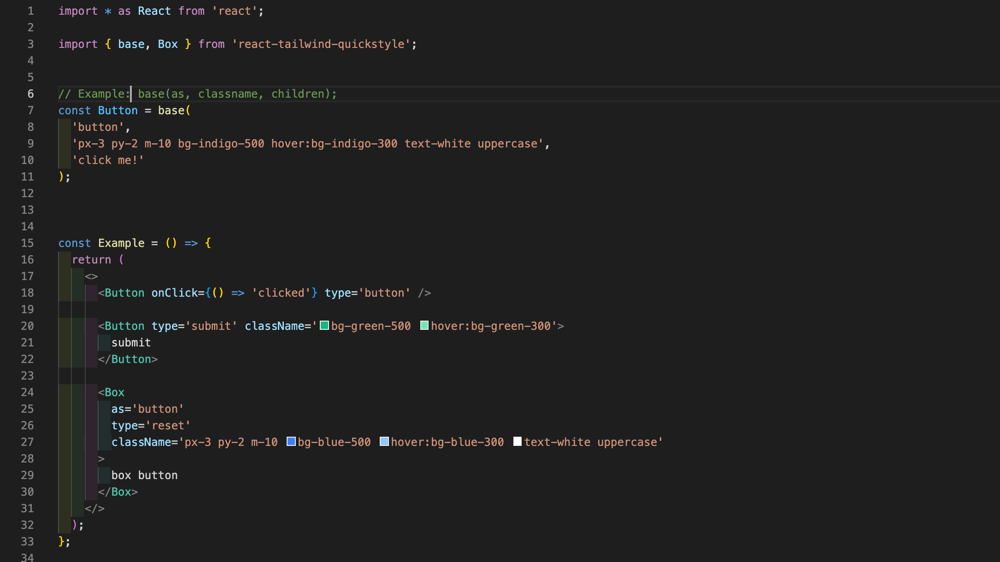

# react-tailwind-quickstyle

A utility function to create styled React components with Tailwind CSS with less boilerplate.



## Motivation

Styled Components have the ability to be designed and extended. Tailwind CSS allows for rapid development. The intention is for a better developer experience for prototyping by combining the two features.

```jsx
import styled from 'styled-components';

export const Image = styled.img`
  position: relative;
  object-fit: contain;
  width: 100%;
  border-radius: 6px;
`;
```

Source: [Mamba UI](https://mambaui.com/components/card)

```jsx
  <div className="max-w-xs p-6 rounded-md shadow-md dark:bg-coolGray-900 dark:text-coolGray-50">
    
    <div className="mt-6 mb-2">
      <span className="block text-xs font-medium tracking-widest uppercase dark:text-violet-400">Quisque</span>
      <h2 className="text-xl font-semibold tracking-wide">Nam maximus purus</h2>
    </div>
    <p className="dark:text-coolGray-100">Mauris et lorem at elit tristique dignissim et ullamcorper elit. In sed feugiat mi. Etiam ut lacinia dui.</p>
  </div>
```

## Dependencies

React: v17

Tailwind CSS: 2.2

## Installation

```
npm i react-tailwind-quickstyle
```

## Usage

```jsx
const Component = base(element, className, children);
```

The `base` function defaults to a `div` element if parameters are not provided.

### Examples:

`Container`, `Form`, and `Input` components:

```jsx
import { base } from 'react-tailwind-quickstyle';

const Input = base('input', 'w-full');
const Form = base('form', 'm-5 col-span-3');
const Container = base('div', 'grid grid-cols-3');

const Login = ()=>{

  return (
    <Container>
      <Form onSubmit={}>
      <Input type='text' />
      </Form>
    </Container>
  )
}
```

### Component styles may be expanded:

```jsx
import { base } from 'react-tailwind-quickstyle';

const Input = base('input', 'w-full');
const Form = base('form', 'm-5 col-span-3');
const Container = base('div', 'grid grid-cols-3');

const Login = () => {
  return <Container className='mx-5 my-3'>...</Container>;
};
```

The `Container` component is now equivalent to:

```jsx
<Container className='mx-5 my-3 grid grid-cols-3'>...</Container>
```

### Components may be nested:

```jsx
const Span = base(
  'span',
  'block text-xs font-medium tracking-widest uppercase dark:text-violet-400',
  'Quisque'
);

const H2 = base(
  'h2',
  'text-xl font-semibold tracking-wide',
  'Nam maximus purus'
);

const TextWrapper = base(
  'div',
  'mt-6 mb-2',
  <>
    <Span />
    <H2 />
  </>
);

const SomeComponent = () => {
  return <TextWrapper />;
};
```

However, changing the children props of `Span` and `H2` within `SomeComponent` would be more difficult after nesting, so it is not recommended to nest if the children props may change.

### Forwarding Refs

All components created with the `base` function have [forwardRef](https://reactjs.org/docs/forwarding-refs.html) included and a `ref` prop is available:

```jsx
import { base } from 'react-tailwind-quickstyle';

const Input = base('input', 'w-full');
const Form = base('form', 'm-5 col-span-3');
const Container = base('div', 'grid grid-cols-3');

const Login = ()=>{
  const inputRef = useRef<HTMLInputElement>(null)

  return (
    <Container>
      <Form onSubmit={}>
      <Input ref={inputRef} type='text' />
      </Form>
    </Container>
  )
}
```

### Extra: A version of a Polymorphic Component

[forwardRef](https://reactjs.org/docs/forwarding-refs.html) included. (not illustrated in example below)

```jsx
import * as React from 'react';

import { Box } from 'react-tailwind-quickstyle';

const Example = () => {
  return (
    <>
      <Box
        as='button'
        type='button'
        className='px-3 py-2 m-10 bg-blue-500 hover:bg-blue-300 text-white uppercase'
      >
        box button
      </Box>
    </>
  );
};
```
